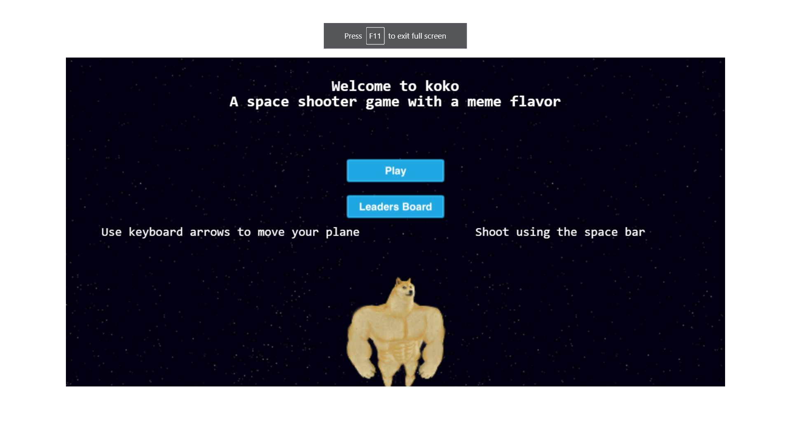
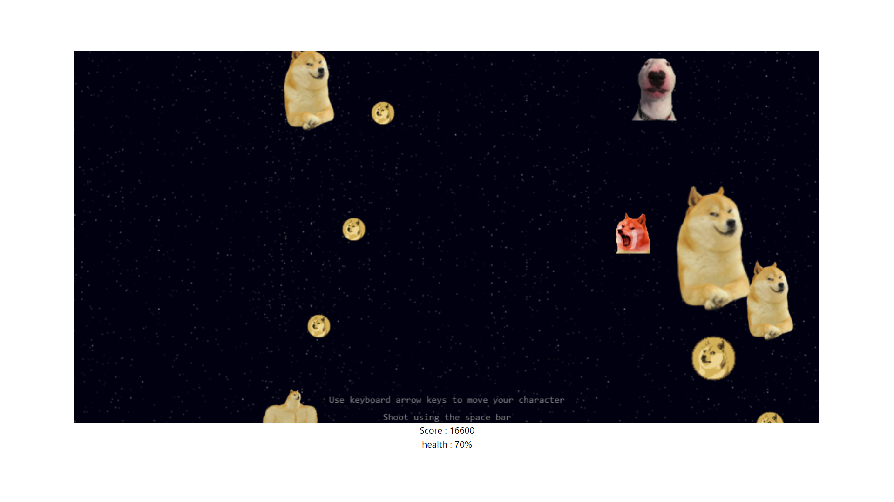
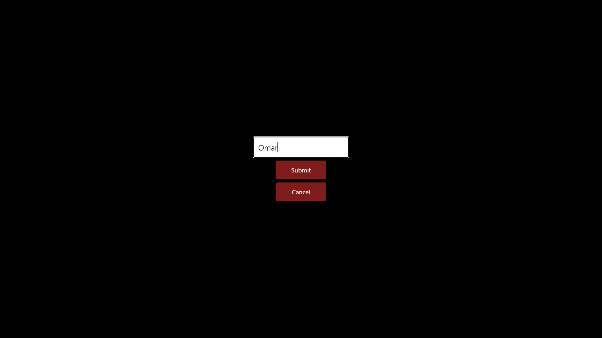
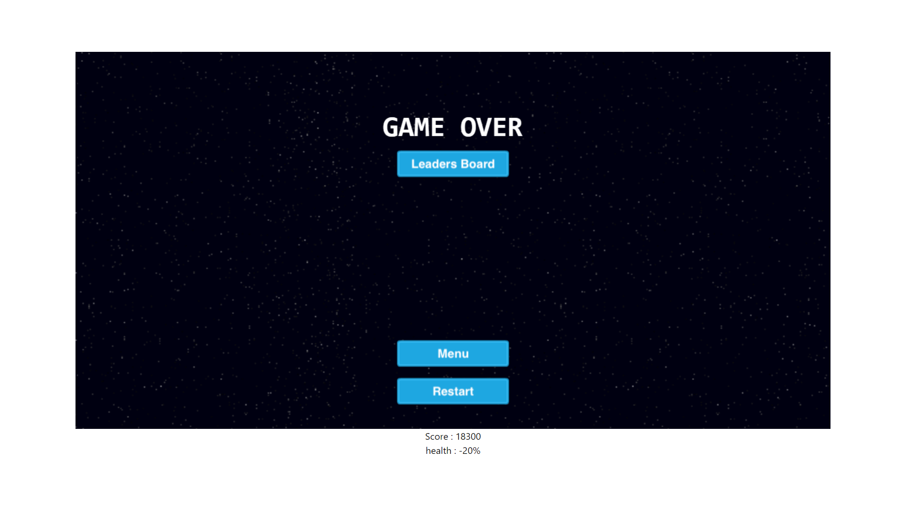
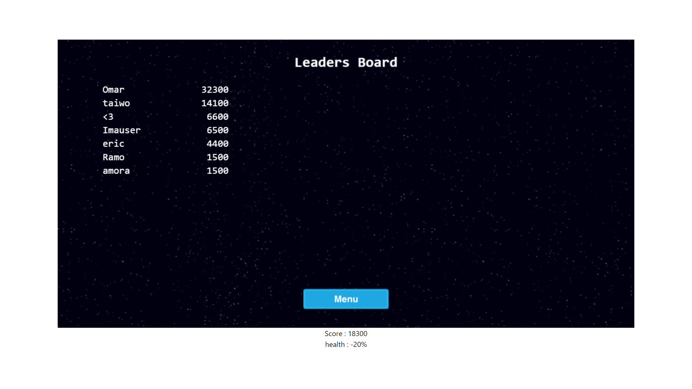

# Project:  KOKO - Meme Space Shooter Game

### Description

An infinit space shooter game, designed based on a meme. Enemies appear at the top of the canvas Some shoot you, some pass straight, some pursue you. You control you character with keyboard arrows while you shoot with space bar. Just destroy as many enemies as you can before your HP runs out and you die. After killing an enemy some point are added to your total score and you can add your name along with your highest score to the leadersboard.

### Live Demo

You can play the game here [Live Demo](https://omar-labana.github.io/koko/).

### Instructions

### How to Install

If you want to install the project follow these instructions:

- Click on the green button "Clone or Download"
- Click on Download ZIP or clone the repo if you have git installed
- Extract the game if you dowloaded the zip file
- In your terminal, navigate to the game's folder
- Run 'npm install'
- Run 'npm run start'
- Open 'localhost:8080/dist' in your browser
- Start shooting!

### Characters used and Game design
#### characters
- Swole Doge (Your character) 
- Doge (Your basic enemy) 
- Walter (Big dog with a bold smile) 
- Cheems (Will run after you) 
#### How to play
- Click on play.

- User the arrow keys to move to the corresponding direction, use spacebar to shoot. 

- After losing all of you health points a credit screen will appear you can add your name or click cancel if you don't want your name to appear in leaderboards.

- You can restart the game with full health points and a score of 0,

- If you submitted your name it will appear in the leaderboards.

You only need to press your arrow keys to move you character and use spacebar to shoot the enemies.

Each enemy destroyed will give you some points.

If any of the enemies attacks you, you lose some health. Upon reaching 0 health the game is over and you are presented with a form to submit you name and score(You can skip submition).
- NOTE: adding you score in the first time might not work because the request might time out when first inviked by herokus' server.

## Dependencies

- JavaScript
- Tailwind CSS
- Phaser3
- Webpack
- Eslint
- Babel
- Jest

## Test Suite

- Jest

## NPM Scripts

Use "npm run-script " followed by any of the following commands: 

- "npm run dev" =>  "webpack --mode development",
- "npm run build" =>  "webpack --mode production",
- "npm run start" =>  "webpack serve --mode development --open",
- "npm run test" =>  "jest"

## 👤 Author

👤 **Omar Labana**

- Github: [@omarlabana](https://github.com/omar-labana)
- Twitter: [@panda4cs](https://twitter.com/panda4cs)
- Linkedin: [Omar Labana](https://www.linkedin.com/in/omar-labana/)

## 🤝 Contributing

Contributions, issues and feature requests are welcome!

Feel free to check the [issues page](https://github.com/ezeilo-su/space-shooter-game/issues).

## Show your support

Give a ⭐️ if you like this project!